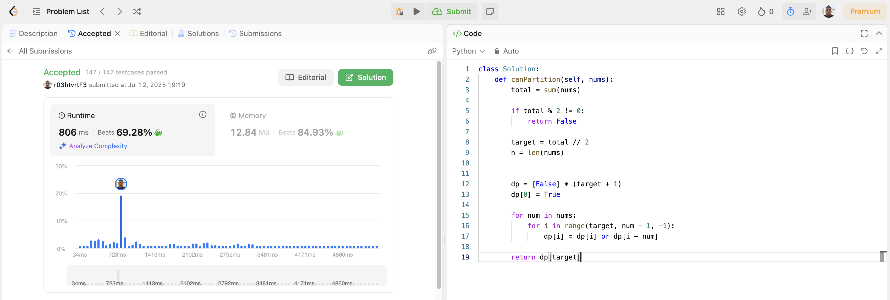
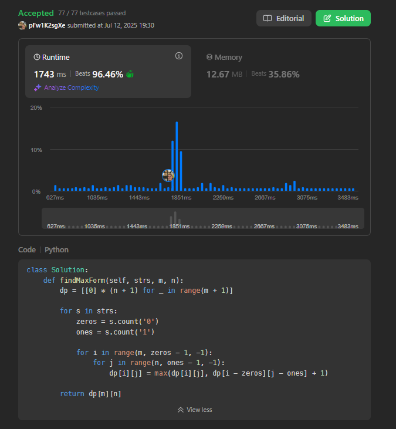

# Algoritmos Ambiciosos

**Conteúdo da Disciplina**: FGA0124 - PROJETO DE ALGORITMOS - T01

## Alunos

<table>
  <tr>
    <td align="center"><a href="https://github.com/ArtAssLou"> <b>Arthur D'Assumpção</b></a> </td>
    <td align="center"><a href="https://github.com/EmersonTeles"> <b>Emerson Luis Teles dos Santos </b></a> 
  </tr>
</table>

| Matrícula | Aluno                         |
| --------- | ----------------------------- |
| 190084570 | Arthur D'Assumpção Loureiro   |
| 200017322 | Emerson Luis Teles dos Santos |

## Sobre

Este trabalho consiste na resolução de quatro exercícios da plataforma LeetCode, com diferentes níveis de complexidade, abordando os principais conceitos de Programação Dinâmica.

## Sobre

| Problema                                                                                                              | Dificuldade | Submit                               |
| --------------------------------------------------------------------------------------------------------------------- | ----------- | ------------------------------------ |
| [1235. Maximum Profit in Job Scheduling](https://leetcode.com/problems/maximum-profit-in-job-scheduling/description/) | Hard     | [clique aqui](https://teams.microsoft.com/l/meetingrecap?driveId=b%2162W9sb1HiUSazSHceDIKd_SnBbr1aVVKppM9bxeGKUJRU20oRnxdTJLoFhFKWdP2&driveItemId=01AFJCRSZ5SBAUHJ6VS5EIFJISJFVA5ILG&sitePath=https%3A%2F%2Funbbr.sharepoint.com%2Fsites%2FGravaes851%2FDocumentos%2520Compartilhados%2FGeneral%2FRecordings%2FReuni%25C3%25A3o%2520em%2520General-20250713_165202-Grava%25C3%25A7%25C3%25A3o%2520de%2520Reuni%25C3%25A3o.mp4%3Fweb%3D1&fileUrl=https%3A%2F%2Funbbr.sharepoint.com%2Fsites%2FGravaes851%2FDocumentos%2520Compartilhados%2FGeneral%2FRecordings%2FReuni%25C3%25A3o%2520em%2520General-20250713_165202-Grava%25C3%25A7%25C3%25A3o%2520de%2520Reuni%25C3%25A3o.mp4%3Fweb%3D1&threadId=19%3A1j7sZe69CYettoG8zThdbYQ7TTOmFAPqxs2IS9AqJ4M1%40thread.tacv2&organizerId=8%3Aorgid%3Abbb3f580-cc85-4123-986c-2ae56335ad3a&tenantId=ec359ba1-630b-4d2b-b833-c8e6d48f8059&callId=97792519-909b-49cb-8d7e-ae5721cc1484&meetingType=MeetNow&organizerGroupId=f14acd09-09c5-48cc-acd9-773444abb873&channelType=Standard&replyChainId=1752436228353&subType=RecapSharingLink_RecapCore) |
| [416. Partition Equal Subset Sum](https://leetcode.com/problems/partition-equal-subset-sum/description/)              | Medium     | [clique aqui](https://link-do-video) |
| [474. Ones and Zeroes](https://leetcode.com/problems/ones-and-zeroes/description/)                                                                                                                | Medium    | [clique aqui](https://link-do-video) |
| [879. Profitable Schemes](https://leetcode.com/problems/profitable-schemes/description/) | Hard | [clique aqui](https://link-do-video)

## Screenshots

1235. Maximum Profit in Job Scheduling

416. Partition Equal Subset Sum

474. Ones and Zeroes

879. Profitable Schemes

## Instalação

## Uso

## Apresentação

Link da apresentação:

Autor: [Arthur D'Assumpção](https://github.com/ArtAssLou) e [Emerson Teles](https://github.com/ArtAssLou).

## Outros
