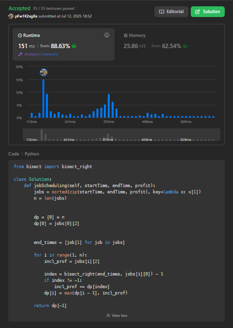

# Algoritmos Ambiciosos

**Conteúdo da Disciplina**: FGA0124 - PROJETO DE ALGORITMOS - T01  

## Alunos

<table>
  <tr>
    <td align="center"><a href="https://github.com/ArtAssLou"> <b>Arthur D'Assumpção</b></a> </td>
    <td align="center"><a href="https://github.com/EmersonTeles"> <b>Emerson Luis Teles dos Santos </b></a> 
  </tr>
</table>

| Matrícula   | Aluno                             |
| ----------- | ---------------------------------- |
| 190084570  | Arthur D'Assumpção Loureiro           |
| 200017322  | Emerson Luis Teles dos Santos     |

## Sobre 
Este trabalho consiste na resolução de quatro exercícios da plataforma LeetCode, com diferentes níveis de complexidade, abordando os principais conceitos de Programação Dinâmica.

## Sobre

| Problema                                 | Dificuldade | Submit        |
|------------------------------------------|-------------|----------------|
| [1235. Maximum Profit in Job Scheduling](https://leetcode.com/problems/maximum-profit-in-job-scheduling/description/) | Difícil     | [clique aqui](https://link-do-video) |
| [416. Partition Equal Subset Sum](https://leetcode.com/problems/partition-equal-subset-sum/description/)                                         | Difícil     | [clique aqui](https://link-do-video) |
| -                                        | Difícil     |  [clique aqui](https://link-do-video) |

## Screenshots

1235. Maximum Profit in Job Scheduling

## Instalação 

## Uso 

## Apresentação 

Link da apresentação: 

Autor: [Arthur D'Assumpção](https://github.com/ArtAssLou) e [Emerson Teles](https://github.com/ArtAssLou).

## Outros 

